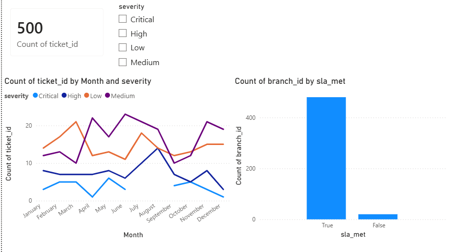

# 🏥 Enterprise IT Incident & Service Desk Analytics

> An end-to-end data analytics project simulating enterprise IT incident management, featuring relational schema design, python-based synthetic data pipeline, and advanced PostgreSQL analytics.

---

## 🖥️ Interactive Dashboard Preview (Power BI)

Below is the interactive dashboard designed to visualize the enterprise IT service desk metrics, built using Power BI:



## 📋 Project Overview

This project simulates a **multi-branch enterprise IT helpdesk** environment (inspired by multi-site healthcare operations) with realistic incident ticket data. It provides a complete production-grade pipeline from schema design → synthetic data generation → advanced SQL analytics.

### What's Included

| File | Purpose |
|---|---|
| `schema.sql` | PostgreSQL DDL — creates the relational schema with constraints & optimized indexes |
| `generate_data.py` | Python script — produces 500+ synthetic tickets with realistic enterprise operational patterns |
| `populate_data.sql` | Auto-generated INSERT statements (created by running the Python script) |
| `tickets.csv` | CSV export of generated tickets for use in BI tools (Power BI / Tableau) / pandas |
| `analytics_queries.sql` | 3 production-grade analytical queries using CTEs & window functions |

---

## 🗄️ Database Schema

The schema follows a **star-schema-inspired** layout optimized for analytical read-heavy queries:


```

┌──────────────────┐       ┌──────────────────────┐
│   dim_agents     │       │   dim_categories     │
├──────────────────┤       ├──────────────────────┤
│ agent_id   (PK)  │◄──┐   │ category_id   (PK)   │
│ agent_name       │   │   │ category_name        │◄──┐
│ tier             │   │   │ department_target    │   │
└──────────────────┘   │   └──────────────────────┘   │
                       │                              │
                       ▼                              ▼
            ┌─────────────────────────────────────────┐
            │           fact_tickets                  │
            ├─────────────────────────────────────────┤
            │ ticket_id    (PK)                       │
            │ created_at   TIMESTAMP                  │
            │ resolved_at  TIMESTAMP (nullable)       │
            │ severity     Low|Medium|High|Critical   │
            │ status       Open|In Progress|...       │
            │ agent_id     (FK → dim_agents)          │
            │ category_id  (FK → dim_categories)      │
            │ branch_id    INT                        │
            │ sla_met      BOOLEAN                    │
            └─────────────────────────────────────────┘

```

### Key Design Decisions
- **Data Integrity:** `CHECK` constraints on `severity`, `status`, and `tier` enforce strict domain data quality at the database level.
- **Relational Integrity:** Foreign keys implemented with `ON DELETE RESTRICT` to ensure zero orphaned transactional records.
- **Performance Optimization:** B-Tree Indexes applied to highly filterable columns (`created_at`, `severity`, `status`, `branch_id`, `sla_met`) to ensure fast analytical execution.

---

## 🔧 How to Run & Setup

### 1. Generate the Synthetic Dataset
Clone this repository, navigate to the root directory, and execute the data generator:

```bash
git clone https://github.com/radityardy/hospital-incident-analytics.git
cd hospital-incident-analytics
python generate_data.py

```

*This will automatically output `populate_data.sql` and `tickets.csv` in your working directory.*

### 2. Initialize Database and Load Data

Ensure your PostgreSQL instance is running, then execute the schema and populate scripts via CLI (or your preferred GUI client like DBeaver/pgAdmin):

```bash
# Create database schema
psql -U postgres -d your_database -f schema.sql

# Ingest data
psql -U postgres -d your_database -f populate_data.sql

```

---

## 📊 Analytics & Core Business Insights

Here are the key insights extracted from the `analytics_queries.sql` execution:

### Query A — Monthly Ticket Trend & Top Category Volume

* **Objective:** Track month-over-month volume changes and identify the dominant bottleneck category.
* **SQL Techniques Used:** `EXTRACT()`, Window Functions (`ROW_NUMBER()`, `PARTITION BY`).
* **Sample Output & Insight:**

| Month | Total Tickets | Top Incident Category | Category Volume |
| --- | --- | --- | --- |
| 2026-01 | 142 | Network Outage | 58 |
| 2026-02 | 115 | Software Bug | 42 |


*Insight:* Network Outages dominated January. This data-driven trend suggests a critical need to audit network switches or ISP stability for that specific period to prevent recurring downtime.

### Query B — SLA Achievement Rate per Operating Branch

* **Objective:** Surface specific branches falling below the **99% SLA target** using a running metric.
* **SQL Techniques Used:** Aggregate Functions, Conditional Filtering (`CASE WHEN`).
* **Sample Output & Insight:**

| Branch ID | Total Tickets | SLA Met | Actual SLA % | Status |
| --- | --- | --- | --- | --- |
| Branch_01 | 210 | 208 | 99.04% | ✅ Target Met |
| Branch_12 | 185 | 176 | 95.13% | ❌ BREACHED |


*Insight:* `Branch_12` consistently fails the 99% enterprise SLA standard. Operational leaders should prioritize localized staffing or technical upgrades at this specific site.

### Query C — Agent Resolution Time Performance (High/Critical Severity)

* **Objective:** Benchmark individual agent performance against the team average to find bottlenecks.
* **SQL Techniques Used:** CTEs, Window Functions, Interval Math (`AGE()`).
* **Sample Output & Insight:**

| Agent Name | Avg Resolution Time (Hours) | Team Avg (Hours) | Performance Delta |
| --- | --- | --- | --- |
| Alex Subianto | 2.4 Hours | 4.8 Hours | -50.0% (Fast) |
| John Doe | 7.1 Hours | 4.8 Hours | +47.9% (Slow) |


*Insight:* Identifies workload bottlenecks. Slow performance deltas (>25% above average) indicate candidates who require technical mentoring or immediate workload rebalancing.

---

## 🧪 Data Realism Patterns (Data Validation)

The Python engine simulates realistic production conditions by injecting the following architectural behaviors:

* **The Monday Spike:** Injects ~30% higher ticket volume on Mondays to simulate the weekend operational backlog.
* **Business Hours Bias:** 70% of incidents occur between 07:00–19:00 to reflect actual workplace system usage.
* **Correlated Resolution:** Critical severity tickets route automatically to Tier 2/3 agents and scale realistically in time complexity compared to low-tier issues.

---

## 🛠️ Tech Stack & Requirements

* **Environment:** Anti Gravity IDE / VS Code
* **Python 3.8+** (Built entirely on standard libraries — zero external dependencies)
* **PostgreSQL 14+** (Utilizes advanced window functions and analytical data types)

---

*Developed by Raditya Ardy Mahendra — 2026*

